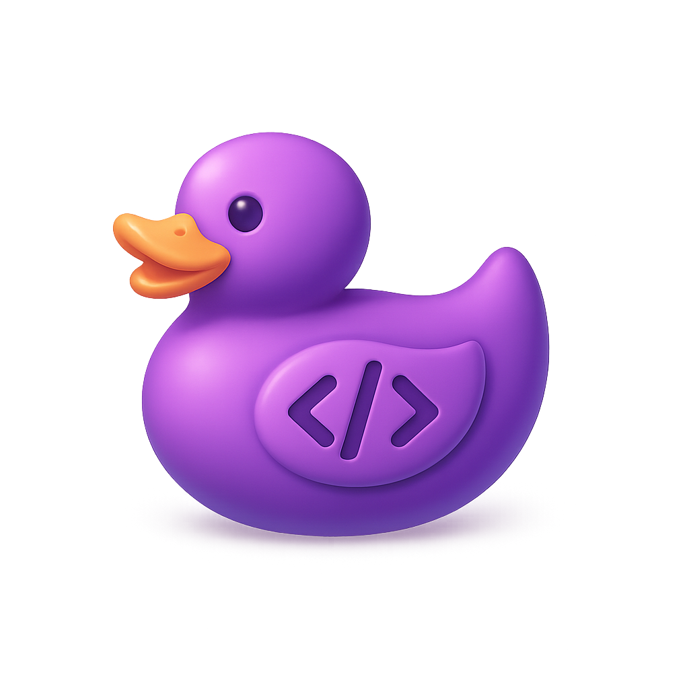

<p align="center">
  
</p>


# DuggyBuggy

**An intelligent code tutoring environment that helps developers fix their own bugs and learn from them — sustainably.**

---

## 🚀 Overview

**DuggyBuggy** is an AI-powered learning system for developers that bridges the gap between instant bug fixes and real learning. Instead of simply giving you the solution to broken code, it guides you through the debugging process with gradual hints, then turns your mistakes into personalized coding challenges to strengthen long-term learning.

---

## 🎓 Motivation

While large language models can instantly fix broken code, this often leads to passive copy-pasting without understanding.<br>
**DuggyBuggy** tackles this by:

* Acting like a tutor, not a solver
* Teaching through hints and reflection
* Turning every bug into a future learning opportunity

Whether you're a beginner or an experienced developer, this system adapts to your skill level.

---

## 📦 Features

- **Helper**: Copy and paste your code, let **DuggyBuggy** analyze it, receive code and text hints, and optionally generate flashcards automatically.
- **Flashcards**: Tasks presented as flashcards, based on your specific coding struggles.
- **Trainer Mode**: Try to solve flashcard tasks on your own or with optional hints, and improve over time through spaced repetition.
- **AI Integration**: Uses Google Gemini 2.5 Flash for code analysis and feedback generation.
- **MongoDB Database**: Stores flashcards and tracks your progress.

---

```
duggybuggy/
├── client/ # Frontend (React + Vite)
├── server/ # Backend (Express + MongoDB)
├── docker-compose.yml # MongoDB Setup
├── package.json # Root scripts (npm start, install-all)
└── README.md
```

## 🚀 Project Setup

### 🛠 Prerequisites

- [Node.js](https://nodejs.org/)
- [Python Venv with Black](https://pypi.org/project/black/)
- [Git for cloning](https://git-scm.com/)
- [MongoDB Compass](https://www.mongodb.com/de-de/products/tools/compass)
- [Docker Desktop](https://www.docker.com/products/docker-desktop)
- [Gemini API Key](https://aistudio.google.com)

(Works also with regular Docker and MongoDB, if you prefer the pain 😉)

---

### 1. Clone Repository
```
git clone <REPO_URL>
cd duggybuggy
```

### 2. Install Dependencies
```
npm run install-all
```

### 3. Activate your python venv and install black

On Windows:
``` 
venv\Scripts\activate
pip install black
```

On Unix:
```
source venv/bin/activate
pip install black
```

### 4. Start App + MongoDB
```
# Either using docker
npm start

# or using podman
npm run start:podman
```
